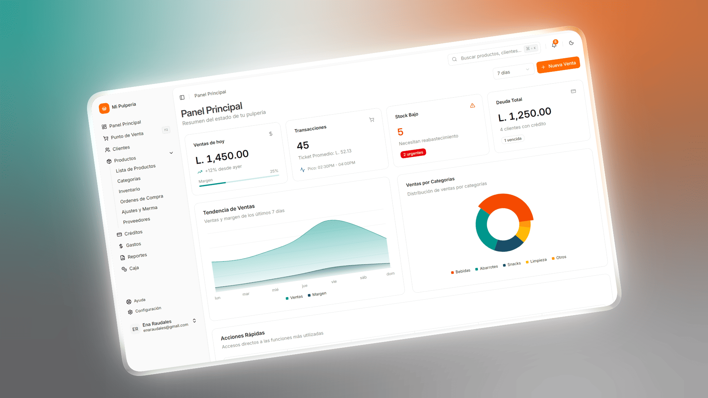

# Mi Pulpería

**Mi Pulpería** es una aplicación de escritorio para la gestión de inventario, ventas, clientes y créditos, diseñada específicamente para pequeños comercios (pulperías, tiendas de barrio, minisúper), donde la realidad no siempre encaja con sistemas rígidos.

El objetivo principal es **simplificar la operación diaria**, manteniendo **control real del negocio**, incluso cuando se venden productos por unidad, peso o volumen, se manejan créditos informales o se reciben distintos métodos de pago.

**Descargar la última versión:**
[⬇️ Ir a la última Release](../../releases/latest)

## ¿Qué resuelve Mi Pulpería?

* Ventas por **unidad o cantidad decimal** (ej. libras, litros).
* Productos con **presentaciones flexibles** (ej. chorizo por unidad o por libra, con precios distintos).
* Control de inventario adaptado a la vida real del negocio.
* Manejo de clientes con **créditos y abonos parciales o totales**.
* Registro de ventas con múltiples métodos de pago (efectivo, transferencia, etc.).
* Aplicación **offline-first**: no depende de internet para funcionar.

## Conceptos clave del dominio

### Presentaciones de producto

Un producto puede tener múltiples presentaciones:

* Chorizo (unidad)
* Chorizo (libra)

Cada presentación tiene:

* Su propio precio
* Su propia unidad base
* Impacto independiente en inventario

Esto evita trucos contables y refleja cómo se vende realmente en una pulpería.

### Cantidades con precisión

Las cantidades **no se manejan como floats**.

* Internamente se almacenan como **enteros escalados** (ej. 1.25 lb → 125)
* Esto evita errores de precisión y redondeo
* Aplica a inventario, ventas, mermas y ajustes

Este enfoque es crítico cuando se venden fracciones como ¼, ½ o 2½ libras.

## Experiencia de usuario

* Interfaz pensada para uso rápido y repetitivo
* Flujo optimizado para teclado
* Sin pasos innecesarios
* Enfocado en personas no técnicas

## Arquitectura y stack técnico

> Esta sección está pensada para reclutadores y desarrolladores.

### Tecnologías principales

* **Electron** – aplicación de escritorio multiplataforma
* **Tailwind CSS** – estilos rápidos y consistentes
* **Vite** – bundler rápido para desarrollo
* **TypeScript** – tipado estricto
* **SQLite** – base de datos local
* **Drizzle ORM** – acceso a datos tipado y migraciones

### Base de datos

* SQLite embebida
* Migraciones versionadas
* Ejecución de migraciones automática al iniciar la app
* Pensada para datos locales y consistencia

### Manejo de estado y lógica

* Separación clara entre:
  * Dominio
  * Persistencia
  * UI
* Lógica de negocio fuera del render
* Enfoque declarativo

## Actualizaciones

* Sistema de auto-actualización
* Descarga silenciosa
* Instalación al cerrar la app
* Compatibilidad con datos existentes

## Estado del proyecto

Mi Pulpería es un proyecto **activo**, utilizado en un entorno real.

Las decisiones técnicas priorizan:

* Robustez
* Claridad
* Mantenibilidad
* Simplicidad antes que complejidad innecesaria

## Soporte
* Correo: [axele1524@gmail.com](mailto:axele1524@gmail.com)