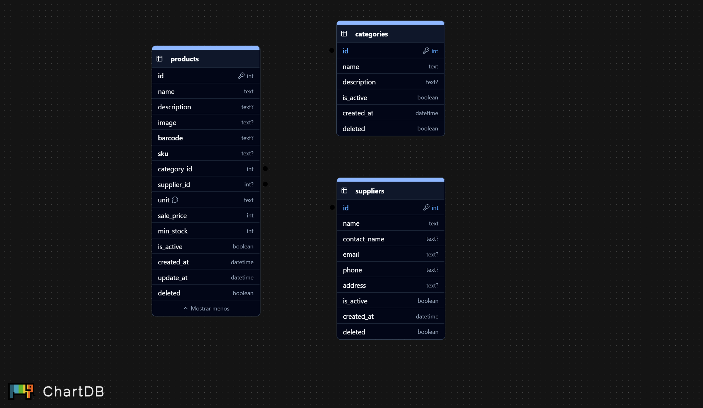

# Mi Pulpería

**Mi Pulpería** es una aplicación de escritorio construida con ```Electron```, ```Vite```, ```TypeScript``` y ```Drizzle ORM```, diseñada para la gestión de inventario, ventas y clientes de una pulpería o negocio pequeño.

La aplicación utiliza ```SQLite``` como base de datos local, sin depender de servicios externos, y expone una API interna (backend) accesible desde el frontend mediante ```preload``` y ```contextBridge```.

## Características

- Gestión de productos y categorias
- Control de inventario
- Registro de ventas
- Clientes y Créditos 
- Base de datos local con ```SQLite```
- API interna testeable
- Arquitectura pensada para escalar
- Tests automatizados con ```Vitest``` (backend + frontend)

## Filosofía del Proyecto

- 100% local (sin backend remoto)

### Separación clara entre:

- UI
- Lógica de negocio
- Acceso a datos
- Backend testeable
- Tests primero en lógica crítica

## Stack Tecnológico

- **Electron:** App de escritorio
- **Vite:** Build y DX rápido
- **TypeScript:** Tipado fuerte
- **SQLite:** Persistencia local
- **Drizzle ORM:** ORM ligero y explícito
- **Vitest:** Testing moderno y rápido

## Estructura del Proyecto

```mi-pulperia/
├── electron/
│   ├── db/
│   │   ├── schema.ts      # Esquema Drizzle
│   │   └── index.ts       # Configuración
│   ├── main.ts            # Proceso 
principal
│   ├── preload.ts         # Bridge seguro (API)
│   └── services/          # Backend (products, sales, etc)
│
├── src/
│   │
│   ├── features/
│   │   ├── products/
│   │   │   ├── api.ts     # Cliente frontend
│   │   │   ├── ui/        # Componentes
│   │   │   └── tests/     # Tests frontend
│
│   └── main.tsx           # Entry frontend
│
├── tests/
│   ├── backend/           # Tests API / servicios
│   └── setup.ts           # Setup global Vitest
│
├── mi-pulperia.db         # Base de datos SQLite
├── drizzle.config.ts
├── vite.config.ts
├── vitest.config.ts
└── package.json
```

## Esquema de Base de Datos



## Testing con Vitest

Vitest se utiliza para probar partes críticas del sistema, tanto en el backend (API) como en el frontend (componentes).

> No se testea Electron.
Se testea la lógica, que es lo que importa.

### Backend – Tests de API / Servicios

**Objetivo:** validar que los servicios devuelvan datos correctos, sin depender del UI ni del preload.

```
~/tests/backend/products.test.ts

import { describe, it, expect } from 'vitest'
import { listProducts } from '@/electron/services/products.service'

describe('Products API', () => {
  it('should return a list of products', async () => {
    const products = await listProducts()

    expect(products).toBeInstanceOf(Array)
    expect(products.length).toBeGreaterThanOrEqual(0)
  })
})
```

- Se prueba la lógica real
- Sin mocks innecesarios
- Idealmente usando una DB SQLite de test

### Frontend – Tests de Componentes

**Objetivo:** asegurar que los componentes rendericen y reaccionen correctamente.

```
~/src/features/products/tests/products-table.test.tsx

import { render, screen } from '@testing-library/react'
import { describe, it, expect } from 'vitest'
import { ProductsTable } from '../ui/products-table'

describe('ProductsTable', () => {
  it('renders products table', () => {
    render(<ProductsTable />)
    expect(screen.getByText(/productos/i)).toBeInTheDocument()
  })
})
```

- Se testea comportamiento, no implementación
- Nada de snapshots
- Nada de probar CSS

```
npm run test
npm run test:watch
npm run test:coverage
```

## Como contribuir

1. Haz un **Fork** del proyecto
2. Crea una **Feature branch**
3. Asegurate de utilizar **TDD**
4. Crea una **Pull Request**